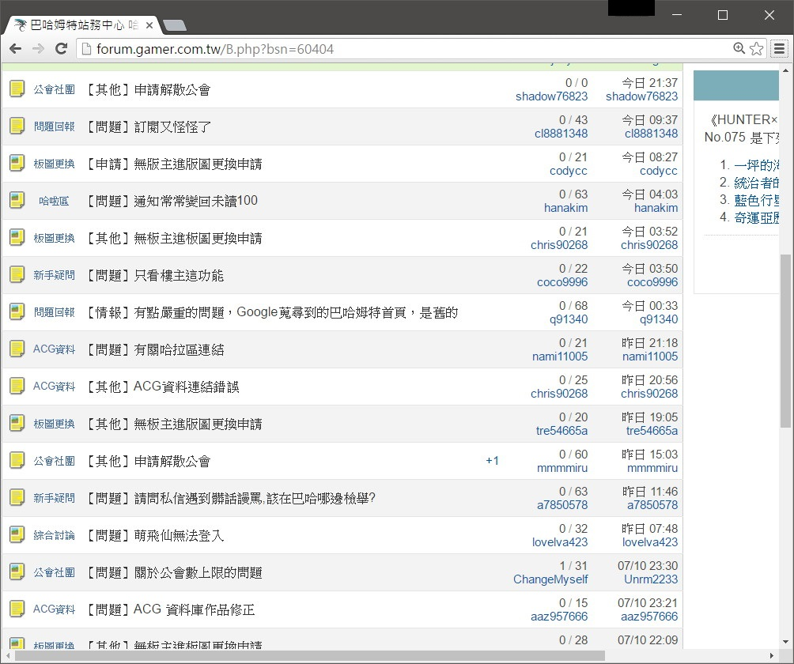

# BahaForumPreviewer(BFP) 巴哈討論區預覽   

BahaForumPreviewer(BFP) 是一個 Chrome Extention。

讓你在逛電腦版巴哈姆特討論區(哈拉區)時，能夠有像手機板一樣有文章、圖片預覽的功能。

# 安裝
點擊下方 [available in the chrome web store] 即可安裝。

# 介紹
不囉嗦，直接看圖。

原本電腦版討論區的畫面：

在安裝BahaForumPreviewer之後：

每篇文章都多了圖片與文字的預覽，讓你不用點進去文章就可以先大略知道文章內容。

# License
MIT

Copyright (c) 2017 johnson18404